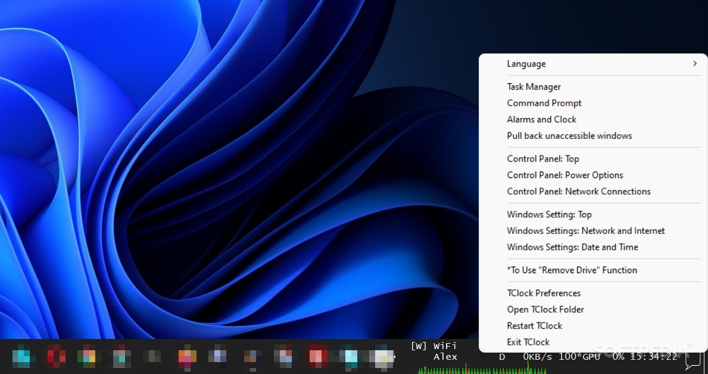
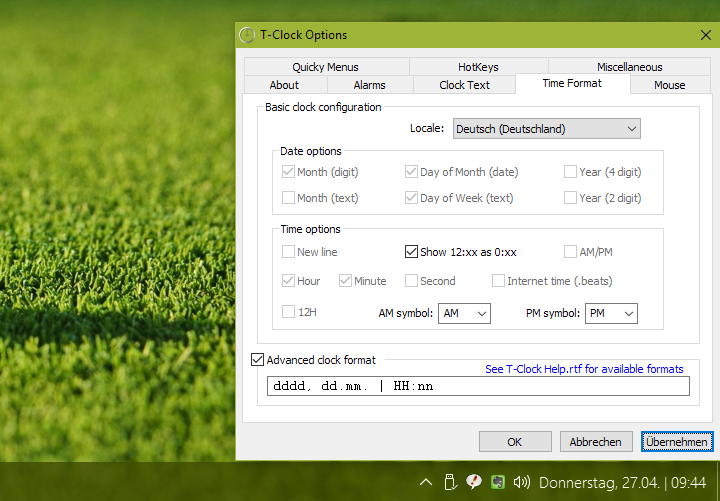
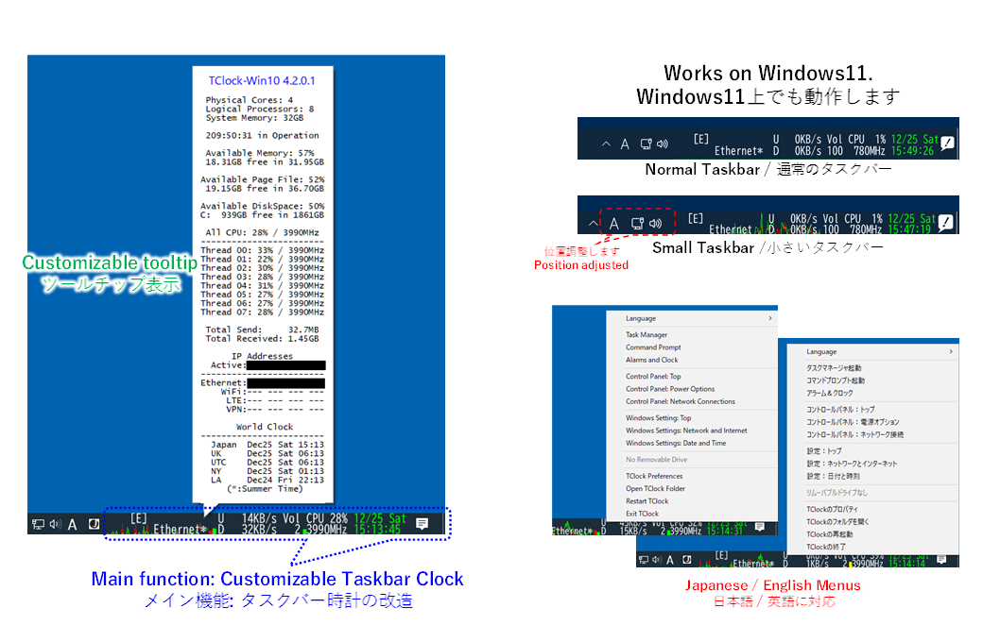

# T-Clock Redux

T-Clock Redux is T-Clock for a modern Windows tray: fonts, colors, multi-line format, alarms, chimes, timers, a stopwatch, and a multi-month calendar with week numbers. t clock redux windows 10 is the native path. t clock redux windows 11 needs ExplorerPatcher, Windhawk, or a neighbor clock. t clock redux x64 is the usual 64-bit build.

This page is the handbook for that tray clock. It is an enhanced fork of Stoic Joker's T-Clock 2010, which itself continues Kazubon's TClock from the 1990s. Two neighbor trees in this pack are the same class: ElevenClock (a Windows 11 overlay clock) and Win11 Extra Clock (seconds and long date next to the calendar flyout).

## Features

T-Clock Redux customizes the Windows taskbar clock. You change format, font, color, and size. You get alarms, an hourly chime, a timer, and a stopwatch. The calendar can show more than one month and week numbers. The tray menu can open a prompt, Task Manager, sleep, or reboot.

ElevenClock, the Python neighbor, lists the same class of work:

- Custom time and date format, including seconds and weekday
- Custom size, background, font, or a style that mimics the stock clock
- Custom position and more than one clock
- Keep the clock over full-screen, or change click actions
- Auto-sync with Internet time
- Multi-monitor clocks, each one set on its own

Win11 Extra Clock restores a Windows 10 style clock on Windows 11: seconds and long date in the calendar flyout, a light tray icon with an update badge, calendar detection, test mode without the calendar, nine position presets plus a custom offset, theme-aware icons, no telemetry.

Clock format UI in T-Clock is [pageformat.c](FILES/clock/pageformat.c). Alarm page is [pagealarm.c](FILES/clock/pagealarm.c). Alarm runtime is [alarm.c](FILES/clock/alarm.c). Settings store is [settings.c](FILES/clock/settings.c). Calendar is [DeskCalendar.c](FILES/clock/DeskCalendar.c).

ElevenClock settings live in [settings.py](FILES/settings.py). Globals are [globals.py](FILES/globals.py). Extra Clock seconds timer is [PreciseSecondTimer.cs](FILES/services/PreciseSecondTimer.cs). Flyout UI is [FlyoutWindow.xaml](FILES/services/FlyoutWindow.xaml).

| Product | Best on | Seconds | Native Win11 taskbar |
| --- | --- | --- | --- |
| T-Clock Redux | Windows 2000 to 10 | Yes | No, needs a patch |
| ElevenClock | Windows 11 | Yes | Overlay, not the stock clock |
| Win11 Extra Clock | Windows 11 22000+ x64 | Yes | Next to the calendar flyout |

## Differences to Stoic Joker's T-Clock 2010

T-Clock Redux vs Build 95/98, from the official tree:

- Win10 Anniversary support (v2.4.1)
- Unicode (v2.4.1)
- Cleaner file layout
- ISO-8601 week number (`Wi`)
- Stock Windows calendar and tooltip usable
- Clocks on extra taskbars on Win8+
- System default colors
- Free clock text angle
- Live preview of text changes
- Text auto-centered
- Custom right-click
- Mouse buttons 4 and 5
- Better horizontal and vertical taskbars
- Calendar hides on a second click when autohide is on
- Custom calendar can show past months
- Right-click menu closer to Windows (CTRL or SHIFT for Run and Exit Explorer)
- Simpler mouse preferences
- Default config closer to Vista+ stock (line break)
- More mouse commands
- Reworked settings dialog
- Better stopwatch (hotkeys, export, stats)
- Better drag and drop
- Bugfixes and rewrites
- MinGW/GCC builds
- Transparency fixes on Vista+
- Portable mode with .ini (v2.4.0)
- Built-in update check (v2.4.0)

Still marked todo upstream:

- Richer format editor with a live preview
- Different timezones on modifiers
- LClock-style fonts and positions for time vs date
- Working timezone identifiers
- Multilingual version
- Resource usage format (CPU, RAM, maybe GPU)
- Improved time sync at startup (admin for install)
- Mouseover style, color, border, or weather
- Switching clock text on a timer
- Multiple text presets on click
- Sun state as a clock background plugin
- Improved hotkeys

None of those todos are shipped. Do not document them as current T-Clock Redux features.

The clock process starts in [main.c](FILES/main.c). Menu and mouse code sit next to it under clock/.

## Requirements

T-Clock Redux: Windows 2000 and newer, documented through Windows 10. t clock redux windows 11 is not a native match. Use ExplorerPatcher or Windhawk, or run ElevenClock / Extra Clock instead.

Windows 7 still runs T-Clock Redux. Windows 11 ExplorerPatcher restores a 10-like taskbar so T-Clock can hook it. Windhawk can do a similar restore. Without one of those, use a neighbor overlay.

ElevenClock: Windows 11. It cannot rewrite the stock clock; it draws its own.

Win11 Extra Clock: Windows 11 build 22000+, x64.

## What's that `_vc2010` build

From 2018, new T-Clock releases use GCC instead of Visual C++ 2010. The old `_static` flavor is the default. `_vc2010` archives stay for advanced users and need the Visual C++ 2010 redistributable, both x86 and x64 on a 64-bit OS. t clock redux x64 users who stay on GCC do not need that pair.

Compile helper in this pack is [compile.bat](FILES/compile.bat).

## Screenshots

Official T-Clock README shows a clock showcase. ElevenClock ships promo stills. Extra Clock shows dark and light flyouts, tray badge, and About. This pack uses FOTO placeholders instead of those remote shots.

## Usage

T-Clock Redux sits in the tray. Click the clock for the calendar. Right-click for the menu. Hold CTRL or SHIFT for extra items. Portable mode writes .ini next to the binary.

ElevenClock: right-click the overlay clock for Restart and settings. It does not change the stock clock.

Win11 Extra Clock:

**Open the flyout (normal).** Click the time on the taskbar. The calendar opens and Extra Clock appears with seconds and long date. Click again or outside to close.

**Test mode.** Tray menu, Show Test. Positions the flyout without the calendar. Custom move is on only when Position is Custom and Show Test is on.

**Tray icon and updates.** Click the Extra Clock tray icon. A red badge means Update available.

**Position presets.** Tray menu, Position: Top-Left, Top-Center, Top-Right, Center, Bottom-Left, Bottom-Center, Bottom-Right, or Custom.

**Start with Windows.** Extra Clock can tick that in setup. T-Clock Redux portable mode does not write a Run key unless you add one. ElevenClock has its own startup toggle.

Calendar detection is [CalendarDetector.cs](FILES/services/CalendarDetector.cs). Tray icon is [TrayIcon.cs](FILES/services/TrayIcon.cs). App start is [App.xaml.cs](FILES/App.xaml.cs).

## Updates

Extra Clock checks on startup and then about every two hours. It reads a plain version file in the repo and can fall back to the GitHub releases API. ETag / 304 cuts traffic. No personal data. A log goes to the local app data folder. Update code is [UpdateService.cs](FILES/services/UpdateService.cs). Version pin is version.txt in FILES.

T-Clock Redux has an in-app update check from v2.4.0. ElevenClock versions live in elevenclock/versions.py.

## Translations

ElevenClock translations follow the project wiki. Extra Clock JSON files live under elevenclock/ in this pack. T-Clock Redux multilingual support is still on the todo list. Japanese localization searches for T-Clock Redux point at community packs, not a built-in catalog.

### Currently Supported languages

ElevenClock lists dozens of languages with percent complete. Catalan, German, English, Spanish, French, Korean, Norwegian, Polish, Russian, and both Chinese variants sit at or near 100%. Others range from a few percent to the high nineties. Last generated date in the neighbor README is 25 Aug 2025. Add or refresh a language through the wiki, not by inventing rows here.

Extra Clock: add a JSON file and switch at runtime. Theme-aware UI is ThemeManager.cs in services.

## Privacy

Win11 Extra Clock sends no telemetry. Network use is the version text and optional releases endpoint.

ElevenClock is open source. Antivirus false positives happen on new unsigned builds. Whitelist if you trust the source.

T-Clock Redux portable mode keeps config next to the exe. No cloud account.

## Project structure

Extra Clock layout, flattened in this pack:

| Upstream | FILES |
| --- | --- |
| Services, tray, UI | services/*.cs, *.xaml |
| languages | elevenclock/*.json |
| Clock C sources | clock/*.c, main.c |
| Calendar | clock/DeskCalendar.c |
| ElevenClock Python | elevenclock/*.py, settings.py |

Tools helper is tools.py under elevenclock/.

## Roadmap

Extra Clock: in-app update flow, more format tweaks, CI, more translations.

T-Clock Redux: the unchecked items under Differences.

ElevenClock: translations and overlay fixes, not a rewrite of the stock clock.

## Frequently asked questions

These are ElevenClock questions from that README. T-Clock Redux answers differ where noted.

**The clock shows over fullscreen.** Enable fullscreen hiding in ElevenClock settings. T-Clock Redux is the tray clock, not an overlay.

**The clock shows over RDP.** Enable RDP hiding (may use more CPU).

**Can it be in my language?** ElevenClock yes, see the wiki. T-Clock Redux not yet as a first-class catalog.

**Antivirus blocks the download.** New unsigned binaries get blocked. Whitelist if you fetched the official tree.

**Seconds show when the setting is off.** Check regional settings. ElevenClock cannot always override the OS.

**Time zone wrong after a change.** Restart ElevenClock from the clock menu.

**The main clock does not change.** ElevenClock cannot modify the stock Windows 11 clock. T-Clock Redux can on Windows 10. On Windows 11 use a taskbar patch or a neighbor.

## Code signing and SmartScreen

Win11 Extra Clock is not code-signed yet. SmartScreen may warn. More info, then Run anyway. Check the SHA-256 on the release. Sign later releases is on their plan.

T-Clock Redux GCC builds are also community-signed at best. Same caution.

## Contributors

ElevenClock exists because of a long contributor list. Extra Clock takes focused PRs. T-Clock Redux lives on GitHub issues and the DonationCoder board.

## The icon

ElevenClock's icon is a collaboration with Xavier Delugo. Extra Clock icons are theme-aware in assets. T-Clock uses its own tray glyph.

## Support

T-Clock: DonationCoder board 324, GitHub issues, or the address on the About screen (click it). About UI is [pageabout.c](FILES/clock/pageabout.c).

ElevenClock: project issues and the developer page.

Extra Clock: issues on that repo.

## Contributing

Extra Clock: one improvement per PR, short description, screenshots if the UI moved.

ElevenClock: see CONTRIBUTING in FILES.

T-Clock Redux: GCC/MinGW is the current compiler path so more people can build.

## License

T-Clock Redux license is marked unknown / likely GPLv2 in the official README and needs research. ElevenClock and Extra Clock ship GPL texts. This pack keeps one LICENSE file (from the ElevenClock tree). Do not add a second license next to README.

## Support the developer

ElevenClock and Extra Clock accept coffee and GitHub sponsors. T-Clock Redux is volunteer. Paying a neighbor does not fund White-Tiger.

## Download

Use the GET badge for this pack. Official T-Clock Redux binaries are stable, beta, and nightly on the GitHub releases page. Pick t clock redux x64 unless you still need `_vc2010`. For t clock redux windows 11, prefer ElevenClock or Extra Clock, or patch the taskbar first. For t clock redux windows 10, T-Clock Redux is the native clock.

Stable is the release tagged latest. Beta is a pre-release. Nightly is testing only. GCC is the current compiler. `_vc2010` is the old MSVC flavor.

Keep the portable folder writable if you use .ini mode. A Program Files copy without write access will fail to save format changes.

sign-n-zip.bat in FILES is a T-Clock release helper. Do not run it unless you are packing a binary you built.

T-Clock Redux, T-Clock, t clock redux windows 11, t clock redux windows 10, and t clock redux x64 stay the same names across those pages.

Do not put a loopback URL in shared notes. Portable mode is an .ini next to the exe.

Registry mode is the other T-Clock config path when the folder is not writable.

## Related Search Terms

T-Clock Redux, T-Clock, t clock redux windows 11, t clock redux windows 10, t clock redux x64, clock, taskbar, windows-11, customization, tray-app, csharp, python, seconds, date, time
